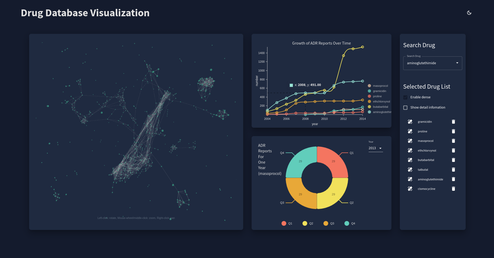
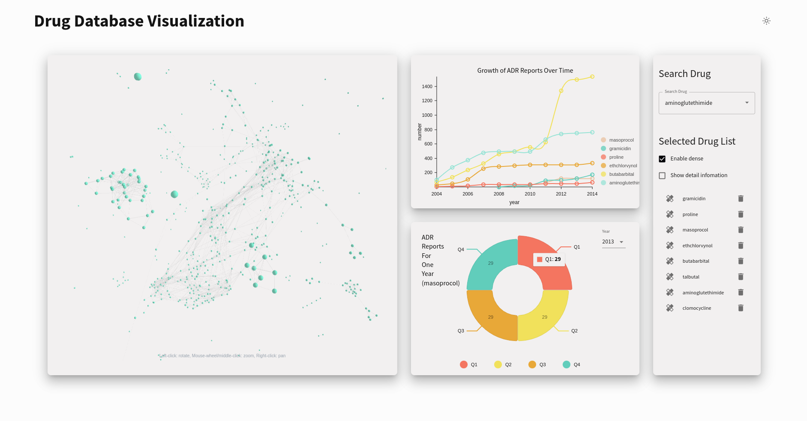

# Drug Database Visualization

> Check out the live website [here](https://faers.tshogx.online/)!

Interactive visualization dashboard of drug similarity and ADR for accelerating drug safety research. 

Build with ReactJs, D3, Threejs, and WebGL.





## Components

- 3D Force Graph (edge represents similarity, nodes represent drugs)
- Line Chart
- Donut Chart / Pie Chart
- Search Bar

## Build

```bash
npm install
npm start
```
